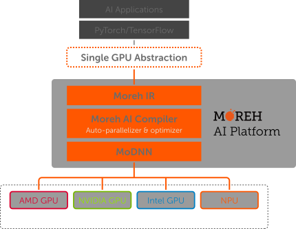

# About MoAI

## Moreh AI appliance for AI accelerators 란?

MoAI( *Moreh AI appliance for AI accelerators* )는 클러스터에 장착된 다양한 종류의 가속기에서 PyTorch 혹은 TensorFlow로 작성된 애플리케이션을 수정 없이 실행시키는 분산 딥러닝 프레임워크입니다.

MoAI Platform을 통해 사용자는 컴파일러 기술의 도움으로 단일 칩에서 대형 클러스터에 이르기까지 다양한 프로세서와 다양한 시스템 규모에서 AI 문제에 집중할 수 있습니다. 따라서 인프라 소프트웨어 간에 충돌 및 호환 문제를 완전히 해결하여 다양한 인공지능 제품·서비스와 기술개발을 촉진합니다.

또한 연산 실행 시에만 GPU 자원을 할당하여 합리적인 비용으로 AI 애플리케이션이 GPU 연산 자원을 효율적으로 사용할 수 있습니다.

## Moreh 솔루션이 선택받는 이유

프레임워크 호환성:
MoAI는 PyTorch와 TensorFlow를 비롯한 표준 딥러닝 프레임워크와의 완전한 호환성을 제공하여 별도의 코드 수정 없이 중요한 AI 문제 해결에 집중할 수 있습니다. 

가속기 이식성:
MoAI의 유연성은 OpenCL을 포함한 다양한 디바이스 백엔드를 지원하여 다양한 GPU 및 NPU와 같은 가속기에서 AI 애플리케이션을 실행할 수 있도록 합니다. 소프트웨어 호환성에 대한 걱정 없이 비용 효율적인 AI 인프라를 구축할 수 있습니다.

대규모 GPU 클러스터:
대형 딥러닝 모델에 대응할 수 있는 대규모 GPU 클러스터링을 지원하여 차세대 AI 모델과 인프라 구축을 지원합니다.

애플리케이션 가상화:
MoAI는 사용자를 물리적인 하드웨어 가속기와 분리함으로써 프로그램 실행 중에만 가상 디바이스에서 GPU 리소스를 할당합니다. 따라서 하드웨어 종속성 없이 유연성을 향상시켜 AI 클라우드 서비스에서 가속기 활용도를 크게 향상시킵니다.

단일 디바이스 추상화:
MoAI는 대규모 클러스터 시스템을 단일 디바이스로 캡슐화하여 사용자가 다중 가속기 및 노드 간의 병렬화를 걱정하지 않고도 AI 애플리케이션을 개발할 수 있게 합니다. 

---

Copyright © 2022 Moreh Corporation