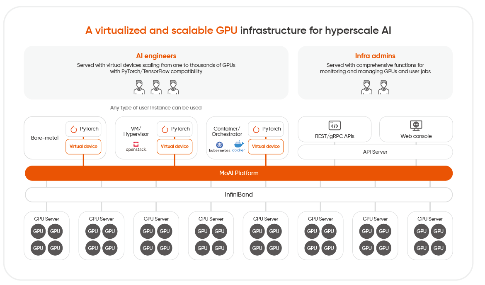

# MoAI Documentation

**MoAI(Moreh AI appliance for AI accelerators)** Platform is a scalable AI platform that allows for easy control of thousands of Graphics Processing Units (GPUs), which are required for developing large-scale deep learning models.

- **Virtual GPU Clusters** - Gain access to virtualized GPU clusters, enabling smooth scalability of your computational resources.
- **Advanced Parallelism** - Effortlessly use advanced parallelism techniques to optimize model training processes.
----

### Getting Started

   | 
---    | ---
 **[Get started with fine-tuning](Tutorials/index.md)**   MoAI Platform Beginner's Guide for Finetuning| [ **AP Guide**](/Supported_Documents/ap/index.md)   Advanced Parallelization (AP) Feature Instructions
[ **Moreh Toolkit Guide**](/Supported_Documents/moreh_toolkit.md)   Command Line Usage |[ **MoAI Platform Features**](/MoAI_Features/index.md)   The virtualization and parallelization features of the MoAI Platform

## Core Technologies of MoAI Platform

As deep learning models progress, they become increasingly complex and demanding significant computational resources as their parameters expanding from billions to trillions. Developing large-scale models involves handling and processing an enormous volume of parameters, a task that's both daunting and time-consuming.

The MoAI Platform's automatic parallelization addresses these hurdles by simultaneously processing multiple tasks, determining the optimal computation methods for large models. This empowers users to concentrate solely on their core AI endeavors, regardless of the scale of their applications or the type of processors they use. Moreover, it efficiently utilizes GPU computational resources at a reasonable cost by allocating them only during calculation execution.

1. **[Various Accelerators, Multi-GPU Support](https://docs.moreh.io/overview/#1-various-accelerators-multi-gpu-support)**
2. **[GPU Virtualization](https://docs.moreh.io/overview/#2-gpu-virtualization)**
3. **[Dynamic GPU Allocation](https://docs.moreh.io/overview/#3-dynamic-gpu-allocation)**
4. **[AI Compiler Automatic Parallelization](https://docs.moreh.io/overview/#4-ai-compiler-automatic-parallelization)**
---

