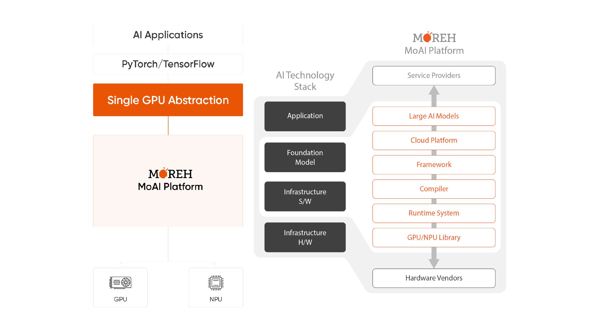
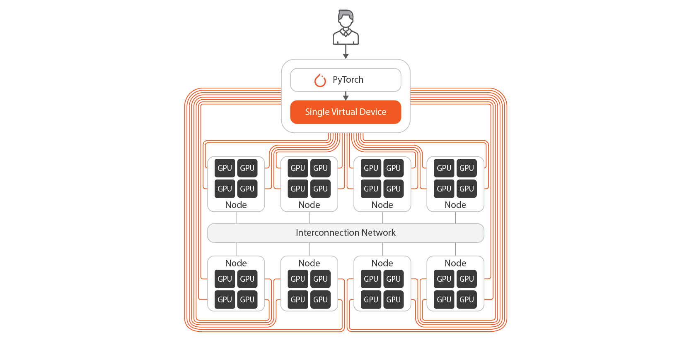
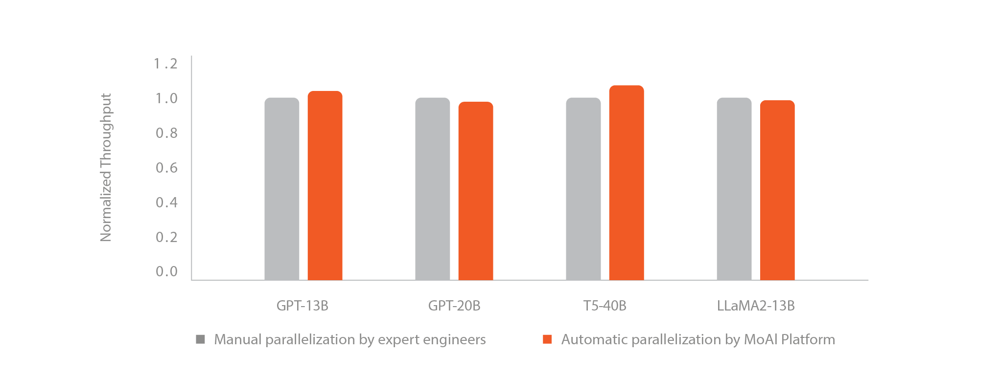

# MoAI Platform 개요

## MoAI Platform이란?
MoAI Platform은 대규모 딥러닝 모델을 개발하기 위한 확장 가능한 AI 플랫폼으로, 수천 대의 GPU를 쉽게 제어하여 AI 모델을 학습하거나 추론할 수 있습니다.

## MoAI Platform 핵심 기술

딥러닝 모델이 진화함에 따라 파라미터가 수십억~수백억 단위로 확장되는 등 점점 복잡해지면서 대규모의 컴퓨팅 리소스가 AI 인프라의 필수 요소가 되었습니다. 대규모 모델을 개발할 때 수동 병렬 처리와 GPU 및 노드 관리를 통해 모델 학습을 최적화하는 과정이 필요하며 이로 인해 개발자들의 많은 노력과 시간이 많이 소요됩니다.

또한, 대규모 모델을 학습하고 추론하는 과정에서 GPU 노드 장애, 메모리 한계 및 병목 현상 등의 이슈가 종종 발생하여, 이를 해결하는 것은 매우 까다로운 작업입니다.

MoAI Platform의 GPU 가상화 기능과 자동 병렬화 기능은 이러한 한계와 어려움을 다음 기능으로 해결하여 대규모 AI 시대에 효율적인 인프라를 제공합니다.

1. **[다양한 가속기, 다중 GPU 지원](https://moreh-dev.github.io/moreh-2024docs-test/ko/overview/#1-%EB%8B%A4%EC%96%91%ED%95%9C-%EA%B0%80%EC%86%8D%EA%B8%B0-%EB%8B%A4%EC%A4%91-gpu-%EC%A7%80%EC%9B%90)**
2. **[GPU 가상화](https://moreh-dev.github.io/moreh-2024docs-test/ko/overview/#2-gpu-%EA%B0%80%EC%83%81%ED%99%94)**
3. **[동적 GPU 할당](https://moreh-dev.github.io/moreh-2024docs-test/ko/overview/#3-%EB%8F%99%EC%A0%81-gpu-%ED%95%A0%EB%8B%B9)**
4. **[AI Compiler 자동 병렬화](https://moreh-dev.github.io/moreh-2024docs-test/ko/overview/#4-ai-compiler-%EC%9E%90%EB%8F%99-%EB%B3%91%EB%A0%AC%ED%99%94)**

---

## 1. 다양한 가속기, 다중 GPU 지원

-

\
&nbsp;
&nbsp;

MoAI 플랫폼은 다양한 AI 가속기를 지원하며, GPU의 종류에 관계없이 다양한 모델 학습과 추론 작업을 실행할 수 있습니다.
사용자는 AMD, Intel 및 NVIDIA 외의 다른 AI 가속기와 함께 사용할 수 있으며, 이를 위해 딥러닝 개발 및 모델 학습을 위한 코드를 수정할 필요가 없습니다.

## 2. GPU 가상화

-
\
&nbsp;
&nbsp;

MoAI 플랫폼의 가상화 기능은 수천 개의 GPU를 하나의 GPU처럼 사용할 수 있게 합니다. 이를 통해 모델링 및 최적화 프로세스를 간소화하여 AI 엔지니어에게 원활하고 효율적인 경험을 제공합니다.

- **유연한 확장성**: 필요에 따라 GPU 자원을 확장하거나 축소할 수 있어 서비스의 확장성을 높일 수 있습니다.
- **관리 및 배포의 간소화**: 여러 GPU를 활용하는 복잡성을 추상화함으로써 딥러닝 작업에서 성능을 향상시키기 위한 리소스의 관리와 배포를 쉽게 할 수 있습니다.
- **비용 절감**: GPU 인프라 관리자는 가상화된 GPU를 효율적으로 활용함으로써 하드웨어의 비용을 절감할 수 있습니다.

MoAI Platform은 실제로 연산중일 때만 GPU 사양에 따라 분 단위로 요금이 부과되는 완전한 종량제 방식으로 설계되어, 이용자의 사용 패턴에 맞추어 기존 클라우드 서비스의 GPU를 특정 가상머신(VM)에 종속시키는 Passthrough 방식 대비 대규모의 비용 절감이 가능합니다.

- 비교 사례:
    - Google Cloud: Google Cloud는 머신당 초 단위로 할당으로 요금을 책정합니다. 다만 리소스가 고정되어 가상 머신을 한번 선택하면 교체하기 어렵습니다.
    - Azure: Azure는 초 단위로 컴퓨팅 용량에 대한 비용을 지불하며, 필요에 따라 소비량을 늘리거나 줄일 수 있습니다. 그러나 인스턴스를 학습에 따라 유연하게 변경할 수는 없습니다.
    - MoAI Platform: MoAI Platform의 GPU 요금 책정은 AI 가속기 크기와 GPU 연산 시간에 따라 정확한 요금을 적용하여 더 효율적인 비용을 제공합니다.
\
\
\
&nbsp;
&nbsp;

## 3. 동적 GPU 할당

MoAI 플랫폼에서는 AI 엔지니어가 필요한 만큼의 GPU 자원으로만 딥러닝 학습 및 추론을 시작할 수 있습니다. 

- 효율적인 GPU 자원 활용: GPU 리소스는 연산 실행 중에만 할당되어 효율적으로 활용할 수 있습니다. 이를 통해 소프트웨어 및 인프라 개발 비용을 절감하고, 개발 및 배포 시간을 단축할 수 있습니다.
- 간편한 클러스터 셋업: MoAI Platform을 사용하면 동적 할당 기능으로 AI 엔지니어가 GPU 클러스터를 쉽게 설정할 수 있습니다. 일반적으로 딥러닝 개발자가 GPU를 사용하기 위해서는 개발 환경 구축을 위해 PyTorch 또는 Tensorflow를 GPU 클러스터 기기의 백노드와 연결하여 각 프로세스가 다른 프로세스들과 데이터를 통신하도록 설정해야 합니다.

## 4. AI Compiler 자동 병렬화

!!!info **자동 병렬화란?** 
딥러닝 모델은 여러 계층(Layer)으로 구성되어 있으며, 각 계층마다 많은 연산을 포함하고 있습니다. 이러한 계층들은 독립적으로 학습될 수 있어 연산들이 병렬로 처리될 수 있습니다. GPU 자동 병렬화는 딥러닝 모델의 학습 및 추론을 자동으로 병렬화하는 기술입니다.
!!!

MoAI Platform의 자동 병렬화 기술은 이러한 연산을 최적의 방식으로 자동으로 분산시키고 병렬화하여 하드웨어 리소스를 최대한 활용합니다.

인공지능 시대에는 대형 언어 모델(LLM) 및 대형 멀티모달 모델(LMM)과 같은 대규모 모델의 훈련 및 추론에 상당한 규모의 GPU 클러스터와 효과적인 GPU 병렬화가 필요합니다. 

현재 NVIDIA와 함께 사용되는 일반적인 AI 프레임워크는 모델의 크기와 복잡성, 그리고 사용 가능한 GPU의 크기나 클러스터에 따라 AI 엔지니어가 병렬화를 수동으로 조정해야 합니다. 이 과정은 시간이 많이 소요되며 종종 몇 주가 걸립니다.

- MoAI 플랫폼은 특정 AI 모델과 GPU 클러스터의 크기를 기반으로 GPU 리소스를 최적으로 활용하는 Moreh AI 컴파일러를 통해 자동 병렬화를 제공합니다.
- 자동 병렬화를 통해 NVIDIA 환경(플랫폼)에서 몇 주가 소요되는 모델 훈련을 2~3일로 대폭 단축할 수 있습니다.

