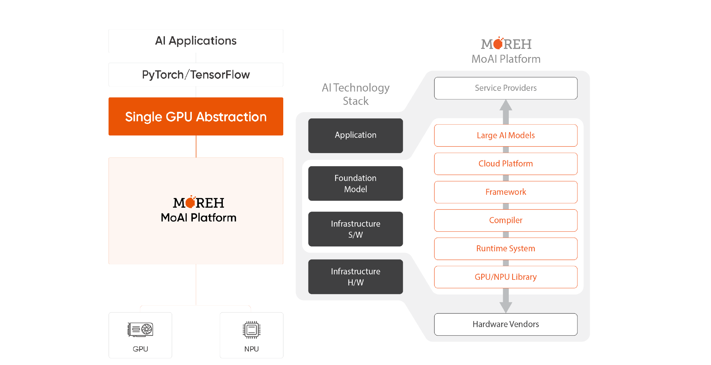
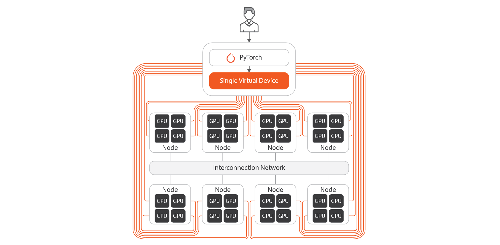

# MoAI Platform Overview

## What is MoAI Platform?

The MoAI Platform is an AI platform designed for developing large-scale deep learning models, allowing users to easily control thousands of GPU clusters for training or inference of AI models.

## Core Technologies of MoAI Platform

As deep learning models evolve, they become more complex, comprising numerous layers with a multitude of parameters. Consequently, large-scale computing resources have become essential components of AI infrastructure. To develop models using such resources, optimizing the training process, including parallelizing the model and manually configuring the cluster environment, is crucial. Managing GPU and node resources for optimal training requires significant time and effort from developers.

To address these challenges, the MoAI Platform offers the following features to support efficient infrastructure in the era of large-scale AI:

1. **[Various Accelerators, Multi-GPU Support](https://moreh-dev.github.io/moreh-2024docs-test/overview/#1-various-accelerators-multi-gpu-support)**
2. **[GPU Virtualization](https://moreh-dev.github.io/moreh-2024docs-test/overview/#2-gpu-virtualization)**
3. **[Dynamic GPU Allocation](https://moreh-dev.github.io/moreh-2024docs-test/overview/#3-dynamic-gpu-allocation)**
4. **[AI Compiler Automatic Parallelization](https://moreh-dev.github.io/moreh-2024docs-test/overview/#4-ai-compiler-automatic-parallelization)**

---

## 1. Various Accelerators, Multi-GPU Support

-

MoAI Platform supports various AI accelerators, allowing users to execute diverse model training and inference tasks regardless of accelerator type. Users can seamlessly utilize accelerators other than AMD, Intel, and NVIDIA without the need to modify existing training and inference code written in Python.
\
&nbsp;

## 2. GPU Virtualization

-

The virtualization feature of the MoAI Platform enables thousands of GPUs to be utilized as a single GPU (Single Virtual Device). This allows AI engineers to easily and quickly execute deep learning training and inference without the need for optimization processes like multi-GPU and multi-node parallelization. By assuming only one GPU and structuring Python code accordingly, users can perform these tasks effortlessly.

Users can expand or shrink GPU resources as needed, increasing the scalability of the service. With a simple one-line command in the MoAI Platform, GPU resources virtualized into a single virtual device can be easily expanded or contracted.

\
&nbsp;

## 3. Dynamic GPU Allocation

In Public Cloud, billing starts when VM instances are created, and changing GPUs requires recreating the instances. Furthermore, once selected, it can be challenging to flexibly change the chosen virtual machine, which can hinder optimization according to the user's needs.

The MoAI Platform is designed to charge fees on a per-minute basis only when AI accelerators are actually in operation, allowing for a complete pay-as-you-go system. This design enables significant cost savings compared to existing cloud services by freeing GPUs from dependency on specific virtual machines (VMs) according to user usage patterns.

## 4. AI Compiler Automatic Parallelization

!!!info What is Automatic Parallelization?
Deep learning models consist of multiple layers, each containing various operations. These operations can be learned independently, enabling parallel processing. However, ML engineers must manually configure combinations of parameters and environment variables for this purpose. The MoAI Platform's automatic parallelization feature swiftly determines the optimal combination of parallelization environment variables. As a result, users can train models automatically applying parallelization techniques such as [Data Parallelism](https://pytorch.org/docs/stable/generated/torch.nn.DataParallel.html), [DDP](https://pytorch.org/tutorials/intermediate/ddp_tutorial.html), [Pipeline Parallelism](https://pytorch.org/docs/stable/pipeline.html), and [Tensor Parallelism](https://pytorch.org/tutorials/intermediate/TP_tutorial.html) during large-scale model training.
!!!

In the era of artificial intelligence, significant GPU clusters and effective GPU parallelization are required for training and inference of large-scale models such as Large Language Models(LLMs) and Large Multimodal Models(LMMs).

Common AI frameworks used with NVIDIA currently require AI engineers to manually adjust parallelization based on model size, complexity, and available GPU or cluster sizes. This process is time-consuming and often takes several weeks.

The MoAI Platform provides automatic parallelization through the Moreh AI compiler, optimizing GPU resources based on the size of specific AI models and GPU clusters. Through automatic parallelization, model training, which typically takes weeks in an NVIDIA environment, can be dramatically shortened to approximately 2-3 days.